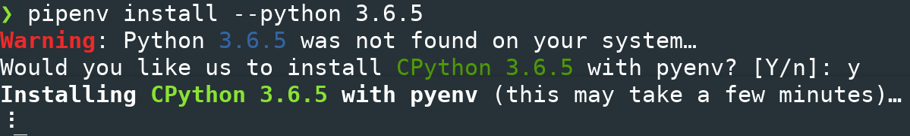
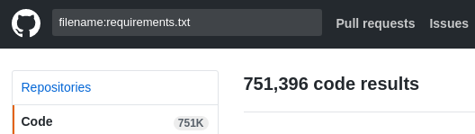
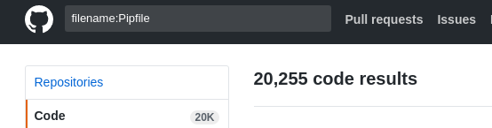

# たのしいPipenv

---?image=pika.png&size=cover

## 私は

- coord.e [こーでぃ]
- Python, JavaScript, 等のやわらかい言語が好き
- C++, 低レイヤ
- 自動化狂t

- @fa[twitter] @coord\_e
- @fa[github] github.com/coord-e

---

## Pythonしてますか?

---

## Pythonのパッケージ管理といえば
# `pip`

しかし...

---

## 僕は`pip`が嫌いだった

---

# `pip`のここがダメ!

- グローバルインストールしかない
- 依存関係を記述する方法がださい (setup.py? requirements.txt?)
- バージョン固定ができない (package-lock.jsonみたいなのがない)

---

## それ、`Pipenv`でできるよ!

---

# `Pipenv`

- "人間のためのPython開発ワークフロー"
- "Python.org が正式に推薦するPythonパッケージングツール"
- 依存関係を`Pipfile`に記述
- 依存関係の組み合わせを`Pipfile.lock`に書いてくれる
- `dev-packages`と`packages`の区別もある

---

# さらに

- `virtualenv`と連携してローカルインストール的な環境を作ってくれる
- `Pipfile`にはpythonのバージョンも指定できる
- しかも`pyenv`と連携して必要なバージョンのPythonを自動でインストールしてくれる!

---



---

## 例: 依存関係の記述

```bash
pipenv install pyflakes matplotlib
```

---

## 例: 依存関係の記述

```
[packages]

pyflakes = "*"
matplotlib = "*"
```

@[1] @[3] @[4]

---

## 例: 依存関係のロック

```
pipenv lock
```

※ `pipenv install`時に自動でやってくれもします

---

## 例: 依存関係のロック

```json
{
    "_meta": {
        "hash": {
            "sha256": "c0b5ac0ed993951c5f0e530223c66ecba24d59a377b2a0c594f2845476282683"
        },
        "pipfile-spec": 6,
        "requires": {
            "python_version": "3.5.2"
        },
        "sources": [
```

@[8]

※読めへん。

---

## 例: 既存プロジェクトからインストール

```shell
$ ls
Pipfile Pipfile.lock
$ pipenv install
Installing dependencies from Pipfile.lock (8cb657)…
  🐍   ▉▉▉▉▉▉▉▉▉▉▉▉▉▉▉▉▉▉▉▉▉▉▉▉▉▉▉▉▉▉▉▉ 25/25 — 00:04:00
```

---

## 例: 仮想環境に入る

```shell
pipenv shell
```

---

# まとめ

- `Pipenv`はすごい!
- やっと`yarn`, `npm`に追いついた

---

# 普及してない...



---

# 普及してない...



---

# 今すぐインストール

```
pip install pipenv
```

---

## ありがとうございました

by @coord\_e
